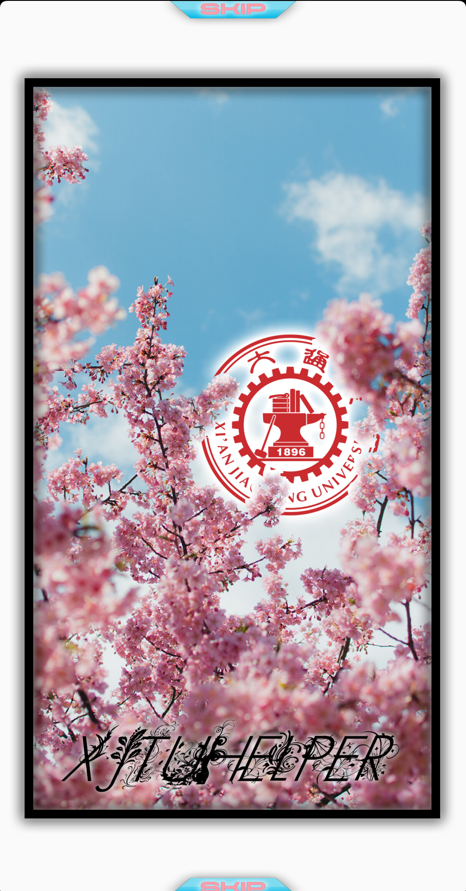

# README

本项目为本科软件工程课程作业，简单实现了一个 C/S 架构的校园新闻获取、资讯共享 App

# 教务处新闻爬虫：
主要由两个部分组成，二者通过json文件作为借口。
## 爬虫功能（spider.py）：
利用request获取并解析教务处网页，进而获取新闻内容和信息
## 服务端（server.py）：
基于 flask 框架实现 HTTP 响应，通过 pymysql 实现与 mysql 数据库通信 

# 校园地图：
## 通过调用高德地图提供的SDK接口和API，实现了导航功能。
具体实现上，通过AMapNavi接口获取AMapNaviView实例并设置监听，实现地图的初始化，当 AMapNavi 对象初始化成功后，会进入 onInitNaviSuccess 回调函数，在该回调函数中调用路径规划方法计算路径：调用方法calculateWalkRoute实现起点坐标和终点坐标的算路，算路成功后：进 onCalculateRouteSuccess 回调，在该回调函数中，可以进行规划路线显示或开始导航

# 信息发布平台：
主程序全局变量调度: Application，根据 sharedpreferences 初始化值
全局常量：Constant
## Activity：
### Welcome: 开始动画，根据全局变量确认跳转目标	
### Login：未登录用户于此登录
### InfoChange：注册或者修改信息（根据 Application 中的状态进行判断）
### Main
	News Fragment
	Map Fragment
	Community Fragment
### 主要组件：
#### ListView
#### NavigationView
#### BottomNavigationView
#### ImageView
#### EditText
#### TextView
#### Button
#### Toolbar
#### Spinner
#### FloatActionBar
### 通信工具：Volley
借鉴网址：https://www.cnblogs.com/mthoutai/p/7043920.html

# 其他设计
## 数据库：

## 服务器
我们是租借阿里云的服务器，然后利用docker技术，开取了一个容器，用来作为此软件的服务器。
