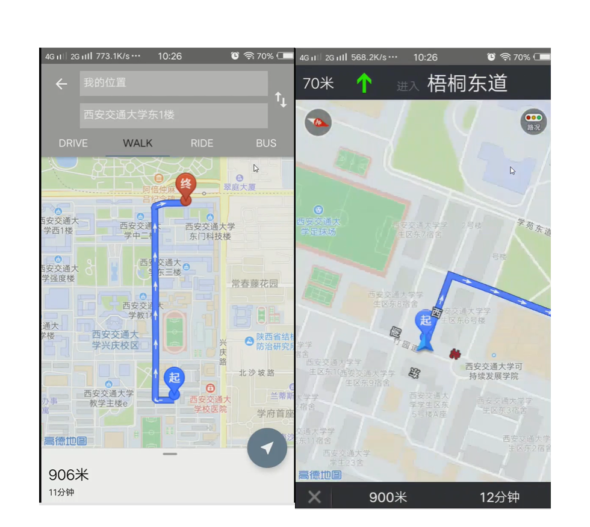

# README

本项目为本科软件工程课程作业，简单实现了一个 C/S 架构的校园新闻获取、资讯共享 App


## 项目结构

介绍项目主目录结构：

* Doc：撰写一些软件工程课程所需要的文档，如用户需求说明等
* Android：项目安卓端程序目录
* Server：项目服务器端程序目录

## Server

运行环境：Ubuntu 18.04 LTS

所需语言环境：python 3.6.9

所需第三方库：Flask

**运行说明**

时间仓促没有写 install 脚本，若想项目生效需要手动配置，后期项目完善后会加入自动安装脚本

1. 为爬虫设置定时任务：文件`./Server/spider.py`为基于 python request 制作的网络爬虫，用于爬取学校各教务的通知信息，需要配合 crontab 定时任务设置定时爬取

2. 设置服务端数据库：服务端使用 mysql 进行数据存储，需要手动建立 2 张数据表，表名不可更改

   * 用户信息表，表名 user_info

     

   * 用户评论表，表名 user_comments

     

3. 运行服务端程序：基于 Flask 框架实现的服务端，主要响应客户端的 HTTP 请求，直接使用 python3 进行后台运行即可

   ```bash
   nohup python3 server.py &
   ```

## Android 

Android app 为本项目面向用户的唯一接口，支持用户注册和登录，目前简单实现了三个主要功能：获取教务处当天新闻通告、校园趣味地图、用户留言社区。

适用安卓版本：8.0+

调用第三方 API：

* Volley：HTTP 通信
* 高德 SDK：趣味地图导航

**用户注册与登录**

新用户可以通过自己的学号（十位）注册一个账号，注册后自动登录，只有登录用户才能使用程序所有内容，老用户可以通过主程序侧边栏的信息修改对自己的账户信息进行修改


**夜间模式**

App 在进入时根据手机本地时间进行日/夜间模式的选择，也可进入主界面后在右上角进行手动切换


**获取新闻**

用户进入后进行页面刷新，从服务器端获取最新的校园新闻，如果自动获取失败，检查网络无误后下拉刷新即可


**校园趣味地图**

功能尚未完全实现，目前已支持校园内部的导航功能，根据高德地图提供的API，点击导航按钮可以实现路线的显示，支持驾驶模式和步行导航。



**用户留言社区**

点击下方导航栏“圈子”进入功能，可以看到最多 50 条用户的留言，点击右上角的加号可以编辑自己的留言和发送，类似 QQ 空间的说说，暂时仅支持文字功能

